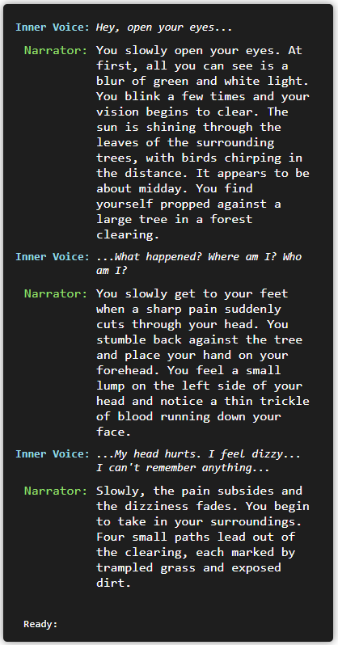
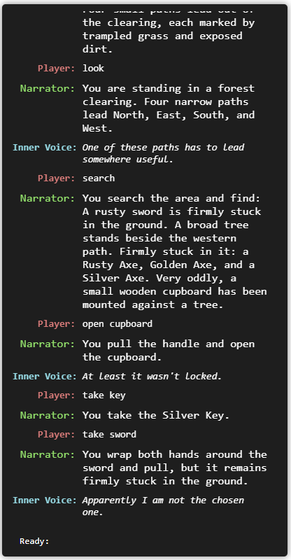

# Project ID10T: Memory Not Found

A browser-based, Zork-inspired text adventure built with Python, Flask, HTML, CSS, and JavaScript.

~~This is a self-directed final project focused on learning Python through a complete application rather than isolated exercises.~~

This project began as a self-directed way to practice Python fundamentals through a complete application rather than isolated exercises.

After learning and practicing the basics of Python, I decided to expand the original idea into a much larger game. As the project grew, the code moved beyond the concepts I had originally studied and began incorporating more advanced Python, Flask, JavaScript, state management, and application architecture.

At that point, I began relying more heavily on documentation, researched code examples, and adapted implementation patterns while continuing to use the project as a way to understand how those pieces work together in a real application.

---

## Concept

The player wakes in a forest clearing with no memory of who they are or how they arrived.

Through exploration, environmental interaction, puzzles, and recovered memories, the player begins to uncover what happened and why they are there.

The interface is styled like a simple terminal and separates responses into:

- **Player** — commands entered by the player
- **Narrator** — descriptions of the world and results of actions
- **Inner Voice** — occasional thoughts, reactions, hints, or commentary
- **System** — startup, loading, and other game-control messages

---

## Current Commands

```text
look
look at <target>

search
search <target>

open <target>
close <target>

take <item>
take <item> from <target>
drop <item>

throw <item>
throw <item> at <target>

use <item> on <target>

wear <item>

inventory

north / south / east / west
n / s / e / w
```

Aliases currently include:

```text
grab
get
pick up
inspect
examine
equip
```

The parser also supports some compound commands, including:

```text
take axe and branch
take axe and throw at tree
take hat and wear it
```

Commands are processed from left to right, and a failed action stops the remaining command chain.

The browser also supports terminal-style command history:

- **Up Arrow** — previous command
- **Down Arrow** — newer command
- Keeps the last **10 commands**

Game-control commands include:

```text
load
load save

new
new game

quit
```

These are handled as system controls rather than in-world player actions.

---

## World Structure

Each location is stored in its own file under `areas/`.

A location can define:

- First-visit narration
- Normal description
- Loose pickup items
- Permanent/interactable scenery
- Searchable objects
- Openable/closeable containers
- Items stored inside or attached to scenery
- Persistent scenery state
- State-dependent descriptions
- Item interactions and effects
- Target-specific throw interactions
- Conditional exits
- Optional Narrator and Inner Voice responses

### Items vs. Scenery

Pickup items are grouped by major game area under `items/` and combined by
`items/itemRegistry.py`.

The area file decides where that item begins.

A loose item can begin directly in the location:

```python
"items": [
    "a1_fallen_branch",
]
```

An item can also begin inside or attached to scenery:

```python
"scenery": {
    "cupboard": {
        "openable": True,
        "closeable": True,
        "searchable": True,
        "items": [
            "a1_house_key",
        ],
    },
}
```

Permanent objects such as trees, doors, safes, cupboards, calendars, fires, or anything that cannot be taken exist as scenery in the area file.

Runtime state is created automatically as the player interacts with the world, so new items and scenery do not need to be manually added to `gameState.py`.

Item IDs use an area prefix to help keep the registry organized:

```text
a1_rusty_axe
a1_wornout_work_gloves
a1_watering_can

a2_admin_key
a2_flashlight
```

The prefix represents the item's original area, not its current location. An Area 1 item keeps its `a1_` ID even if the player carries it into another area.

---

## Game State and Interactions

The game uses a centralized runtime state for:

- Current area and location
- Visited locations
- Inventory
- Equipped items
- Item state
- Scenery state
- Item placement
- Area state
- Game flags

Items can carry their own changing state. For example, a watering can can track whether it is filled:

```python
"state": {
    "filled": False,
}
```

Scenery tracks persistent world conditions such as:

```python
"state": {
    "isOpen": False,
    "isLocked": True,
    "isBroken": False,
}
```

Interactions are defined on the scenery being affected. They can require item state, scenery state, inventory items, equipped items, or flags, then apply effects when successful.

This allows puzzles and world interactions to be defined mostly through area and item data instead of adding one-off logic to the game engine.

---

## Item Behavior

Items can support:

- Taking
- Dropping
- Looking/examining
- Wearing
- Throwing
- Persistent item state
- Being moved between locations
- Being attached to scenery
- Being destroyed after an action

Example:

```python
"a1_fallen_branch": {
    "name": "Fallen Branch",
    "aliases": [
        "fallen branch",
        "branch",
        "stick",
    ],
    "description": "A fallen branch from a nearby tree.",
    "worldDescription": (
        "a <em><span class='item-highlight'>fallen branch</span></em> "
        "lying on the ground."
    ),
    "looseDescription": (
        "a <em><span class='item-highlight'>fallen branch</span></em> "
        "lying on the ground."
    ),
    "takeable": True,
    "wearable": False,
    "onThrow": {
        "default": {
            "response": (
                "You throw the branch. It spins through the air "
                "and drops into the grass."
            ),
            "destroyItem": False,
        },
    },
},
```

If an item survives being thrown or dropped, it becomes a loose item in the current location and can be picked up again.

Target-specific behavior belongs to the scenery being targeted. For example, throwing an axe at a tree or using a watering can on a fire can have a unique result without putting every possible target into the item definition.

---

## Look and Search

`LOOK` describes the current location.

`LOOK AT <target>` examines a specific visible item or scenery object.

`SEARCH` looks for items and things of importance in the current location.

`SEARCH <target>` searches a specific scenery object or container.

Search results react to the current game state:

- Taken items disappear from their original location
- Dropped or thrown items appear where they now exist
- Attached or exposed items can appear in a general search
- Closed containers hide their contents
- State-dependent scenery can block access to contained items

General search results are formatted into natural lists instead of returning separate lines for every item.

---

## Inventory

The inventory display uses a responsive CSS grid rather than one long sentence.

On larger screens, items can appear across multiple columns. On smaller screens, the grid reduces the number of columns automatically so the inventory remains readable on phones and tablets.

Item names use the same highlighted styling as items referenced elsewhere in the game output.

---

## Save and Recovery

The game automatically saves the current state to browser `localStorage`.

There is no manual save command and no save-slot system. The browser keeps one current game state and updates it as the player continues.

The saved state includes the player's current location, inventory, equipped items, item state, scenery state, moved items, opened containers, broken objects, puzzle progress, and other runtime state.

When the game opens:

- If no valid save exists, a new game begins normally
- If a save exists, the player is prompted to resume or start over

```text
Type load save to resume, or type new game.
```

The following commands are accepted at that prompt:

```text
load
load save

new
new game
```

Typing `quit` ends the current play session without deleting progress and returns to the load/new-game prompt.

Loading and starting a new game are system actions, so they are not displayed as `Player:` commands.

---

## Backend Structure

```text
game/
├── commandParser.py
├── definitionValidator.py
├── failedActions.py
├── movement.py
├── parserUtils.py
└── handlers/
    ├── common.py
    ├── drop.py
    ├── inventory.py
    ├── look.py
    ├── open_close.py
    ├── search.py
    ├── take.py
    ├── throw.py
    ├── use.py
    └── wear.py

items/
├── area1.py
└── itemRegistry.py

states/
└── gameState.py
```

Action logic is separated into handlers while shared lookup, state, item-placement, and scenery helpers live in `handlers/common.py`.

`gameState.py` maintains the central runtime state and provides reset and restore behavior for new games and browser save recovery.

---

## Development Workflow

Run the project with:

```bash
python start.py
```

or:

```bash
python3 start.py
```

The launcher:

- Installs Flask if needed
- Starts Flask in debug mode
- Opens the game in the browser
- Automatically reloads Python changes during development
- Refreshes the browser after the Flask server reloads
- Shuts down cleanly with `Ctrl+C`

Because the browser now stores the current game state, development reloads no longer require restarting from the beginning of Area 1. The saved game can be resumed after the browser refreshes.

---

## Current Progress

The project currently supports:

- Flask backend and browser terminal UI
- Area-to-area movement
- Conditional exits based on game state
- First-visit and repeat-visit behavior
- Command parsing and aliases
- Compound commands
- Pronoun carry-forward for supported command chains
- Central item registry
- Runtime world state
- Persistent item placement
- Item state
- Scenery state
- State-dependent descriptions
- Responsive inventory grid
- Taking and dropping items
- Throwing items
- Target-specific throwing interactions
- Using items on scenery
- Wearable and equipped items
- Searchable scenery
- Openable/closeable containers
- Items stored inside or attached to scenery
- Generic interaction requirements and effects
- Custom success and failure responses
- Optional Inner Voice responses
- Conditional puzzle behavior
- Automatic browser-based game saving
- Resume and new-game recovery flow
- `quit` session control
- Terminal-style command history
- Development hot reload

The underlying game engine and state systems are now largely in place.

Current development is focused on building **Area 1: The Forest**, including its narrative, locations, scenery, items, puzzles, and progression into Area 2.

The goal is for most future game content to be created through area and item definitions rather than adding one-off logic to the game engine.

---

## Screenshots




